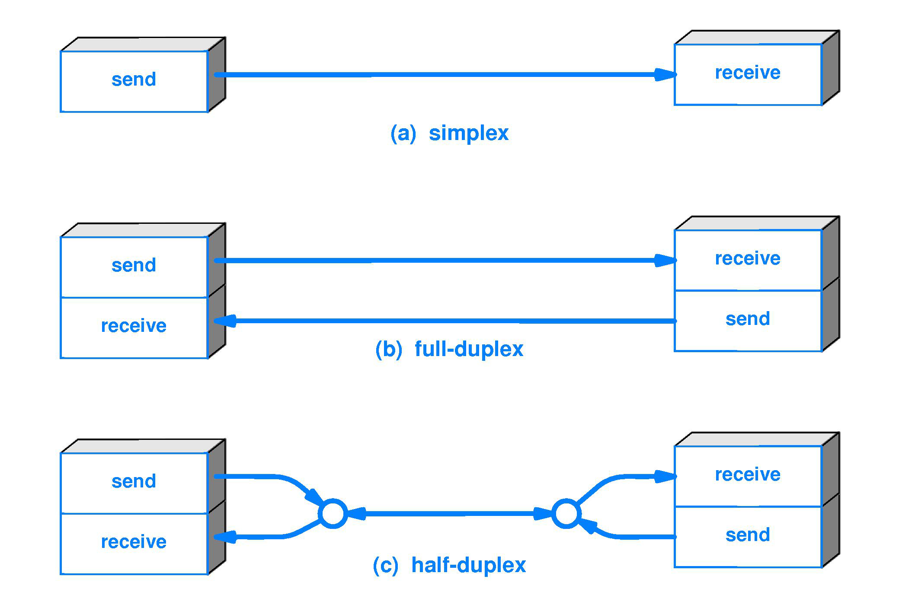

# half-duplex
Implementação de comunicação bidirecional usando portas AND para controlar o "acesso" ao meio compartilhado

## Full Duplex x Half Duplex

O termo full-duplex descreve a transmissão e recepção de dados simultâneas em um canal. Um dispositivo full-duplex é capaz de transmitir dados de rede bidirecionais ao mesmo tempo. Dispositivos half-duplex só podem transmitir em uma direção por vez. Com o modo half-duplex, os dados podem se mover em duas direções, mas não ao mesmo tempo. O termo duplex, por si só, refere-se à capacidade de enviar e receber dados. Duplex é freqüentemente usado ao falar sobre conversas por telefone ou computador. Um ambiente Ethernet full-duplex pode usar um par de cabos trançados para recebimento de pacotes e um par de cabos trançados para transmissão.

# Diferenças entre sistemas Full e Half Duplex

Existem diferenças distintas entre sistemas full e half-duplex. Com o modo half-duplex, cada caractere transmitido é imediatamente exibido em um monitor. Se um dispositivo estiver operando no modo full-duplex, os dados transmitidos não aparecerão na tela até que sejam recebidos e retornados. A Ethernet full-duplex economiza tempo quando comparada à half-duplex porque alivia colisões e retransmissões de quadros. Enviar e receber são funções distintas, criando um sistema onde há capacidade total de dados em cada direção. Em contraste, o half-duplex pode ser usado para conservar a largura de banda.




## Controle de acesso ao meio

## Métodos de Acesso ao meio

- As implementações mais correntes de redes locais
  utilizam um meio de transmissão que é compartilhado
  por todos os nós.
- Quando um nó emite dados, todos os outros nós os
  recebem. Cabe a cada nó analisar o endereço de
  destino para determinar se os dados lhe são destinados
  ou não.
- Pelo fato de todos os nós receberem os dados, este tipo
  de redes são conhecidas por redes multiponto ou
  "broadcast".

## Problema:

- Como o meio de transmissão é compartilhado, é
  necessário estabelecer uma ordem de acesso ao meio
  entre as estações que desejam transmitir.

## Solução

Na arquitetura de redes OSI, esta função é desempenhada por uma sub-camada da camada de enlace, designada por “Medium Access Control (MAC).

- **Esta sub-camada implementa os algoritmos de controle de acesso ao meio de transmissão.**

## Proposta de implementação com arduino

A comunicação é baseada em duas portas que indicam se aquele módulo arduino está apto para receber ou enviar informações,

OBS: Todos os Arduino podem receber e enviar dados, como se estivessem em uma rede real, conectados por um barramento simuntâneo, mas o que vai definir se a informação chegará para os elementos na rede é a configuração do que chamaremos de **chave dados: DE e DD ou RE e RD (D = Driver | R = Receiver)**. Que podem estar nas configuração Enable ou Disable.

****


## Driver

```cpp
// C++ code
//3 read | 2 drive
int incoming = 0;
String received;
void setup()
{
  Serial.begin(9600);
  pinMode(2, OUTPUT);
  pinMode(3, OUTPUT);

}

void loop()
{
  digitalWrite(3, HIGH);
  if (Serial.available() > 0){
  	incoming = Serial.read();
    Serial.write(incoming);
  }

}
```

## Receivers

```cpp
// C++ code
//3 read | 2 drive
int incoming = 0;
String received;
void setup()
{
  Serial.begin(9600);
  pinMode(2, OUTPUT);
  pinMode(3, OUTPUT);

}

void loop()
{
  digitalWrite(3, HIGH);
  if (Serial.available() > 0){
  	incoming = Serial.read();
    Serial.write(incoming);
  }

}
```

## Implementação do Circuito

[](https://www.tinkercad.com/things/8uOCPVDmlSC-half-duplex)

# Referências

[Control A Digital Logic AND Chip With Arduino Uno](https://create.arduino.cc/projecthub/mariogianota/control-a-digital-logic-and-chip-with-arduino-uno-6d8602)
